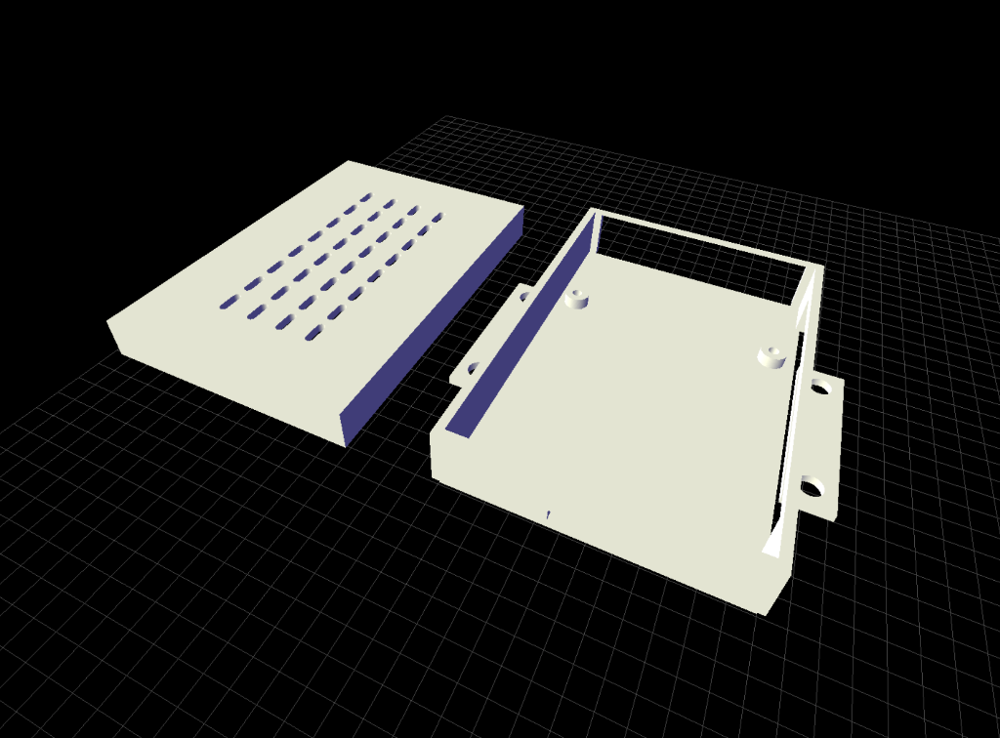

<p align="center">
  
</p>

<h1 align="center">Lattice</h1>

<p align="center">
  <strong>Design 3D parts with natural language.</strong><br>
  Lattice is an agentic CAD framework that turns prompts into printable STL files.
</p>

---

**Lattice** is a Python-based parametric CAD framework designed exclusively for **agentic coding workflows**. Built on [build123d](https://github.com/gumyr/build123d), Lattice enables you to describe 3D designs in natural language and let AI agents handle the complex CAD implementation.

## Why Agentic-Only?

Traditional CAD tools require deep technical knowledge and manual manipulation. Lattice flips this model:

- **Natural Language Design**: Describe what you want, not how to build it
- **AI-First Architecture**: The workflow assumes an AI agent is driving the code
- **Patterns over Primitives**: Reusable patterns make agent output more reliable
- **Validation Built-In**: Automatic checks catch common CAD mistakes before printing

## Core Philosophy

*   **Parametric First:** All designs are driven by parameters (dimensions, angles, etc.), allowing for rapid iteration
*   **Python as DSL:** No static config files for geometry—the design definition *is* the executable Python script
*   **Agent-Driven:** Designed to be operated through conversational AI, not manual coding

## Getting Started with Agentic Workflows

### Required Tooling

Lattice is designed to work exclusively through AI-assisted development:

- **IDE**: [Antigravity](https://antigravity.ai) - The agentic coding environment for Lattice
- **AI Model**: Gemini 2.0 Flash or higher (Gemini 2.0 Flash Thinking recommended for complex designs)
- **Extension**: `vscode-stl-viewer` for viewing generated models in-IDE

### Workflow Overview

**Always start CAD sessions with `/cad`** - This primes the agent with the full context of Lattice's patterns, utilities, and design philosophy.

The agent automatically determines the appropriate action:

| Request Type | Agent Action | Example |
|--------------|--------------|------------|
| **Parametric Adjustment** | Runs generator with new parameters | "Make it 80mm wide" |
| **New Design** | Creates new project with full implementation | "I need a phone stand with cable routing" |
| **Modification** | Edits existing project code | "Add ventilation to the left panel" |

### Example Prompts

**Simple parametric changes:**
```
/cad I need a bracket that's 100mm wide and 50mm tall
```

**Complex custom designs:**
```
/cad I need an enclosure for a Raspberry Pi 4. It should have ventilation on top, 
     mounting tabs on the sides, and snap together without screws.
```

**Project modifications:**
```
/cad Update the computer_case project - make the standoffs 5mm taller
```

## Installation

### Prerequisites

- **Python 3.12+** (see `.python-version` for exact version)
- **pip** package manager
- **Antigravity IDE** with `vscode-stl-viewer` extension (see Getting Started above)

### Quick Setup (Agent-Assisted)

If you're using an AI coding assistant, simply ask:
```
Set up this repository for me - create the virtual environment and install dependencies
```

### Manual Setup

1.  **Clone the repository**:
    ```bash
    git clone https://github.com/agustinsacco/lattice.git
    cd lattice
    ```

2.  **Create a virtual environment**:
    ```bash
    python -m venv .venv
    source .venv/bin/activate  # On Windows: .venv\Scripts\activate
    ```

3.  **Install dependencies**:
    ```bash
    pip install -r requirements.txt
    ```

4.  **Verify installation**:
    ```bash
    python -m cad_engine.generator --help
    ```

### Troubleshooting

If you encounter issues with `build123d` or OpenCASCADE:
- Ensure you have the correct Python version
- On some systems, you may need build tools: `sudo apt install build-essential` (Linux) or Xcode Command Line Tools (macOS)

## Usage

### 1. The Standard Generator (Parametric Brackets)
For simple, standard parts like V-slot brackets, you can run the core generator directly without creating a new project.

**Example: Generate a 60mm wide bracket**
```bash
python -m cad_engine.generator --width 60 --height 40 --thickness 5 --output outputs/bracket_60mm.stl
```

### 2. Creating a Custom Project
For unique parts or complex modifications, the recommended workflow is to scaffold a new project. This copies the base generator logic into a dedicated space where you can heavily modify the geometry without affecting the core engine.

**Steps:**

1.  **Create a Project Directory**:
    ```bash
    mkdir -p projects/my_custom_part
    touch projects/my_custom_part/__init__.py
    ```

2.  **Bootstrap the Design**:
    Copy the base generator to your project as a starting point.
    ```bash
    cp cad_engine/generator.py projects/my_custom_part/design.py
    ```

3.  **Edit the Design**:
    Open `projects/my_custom_part/design.py` and modify the `generate_bracket` function (or rename it) to build your transform the geometry using `build123d` commands.

4.  **Build the Model**:
    Run your project's module to generate the STL.
    ```bash
    python -m projects.my_custom_part.design
    ```
    By default, this saves the output to `projects/my_custom_part/model.stl` (if you updated the default in your design file) or the path specified via arguments.

## Project Structure

```text
retrograde-nebula/
├── cad_engine/             # Core logic and utilities
│   ├── generator.py        # The base parametric generator script
│   └── utils.py            # Helper functions (e.g., mesh analysis)
├── projects/               # User-created designs
│   └── table_hook/         # Example Project
│       ├── __init__.py
│       ├── design.py       # Modified design script for this specific part
│       └── model.stl       # Generated 3D model
└── requirements.txt        # Python dependencies
```

## Technologies

*   **Language**: Python
*   **CAD Kernel**: [build123d](https://build123d.readthedocs.io/en/latest/) (Open CASCADE technology)

## Gallery & Examples

### Raspberry Pi 4 Enclosure
A complex design featuring port cutouts, mounting standoffs, and ventilation patterns.


*Prompt: "/cad I need an enclosure for a Raspberry Pi 4. It should have ventilation on top, mounting tabs on the sides, and snap together without screws."*
