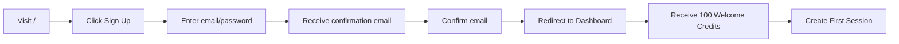
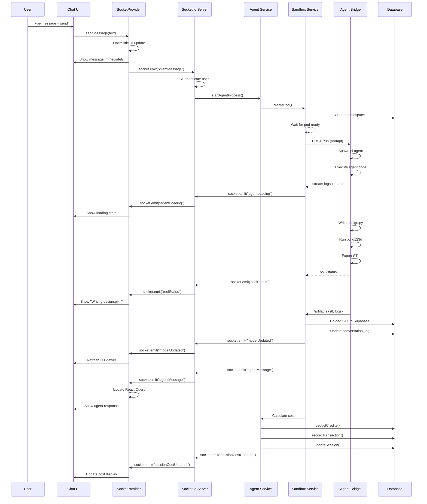
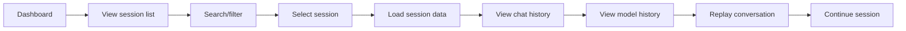
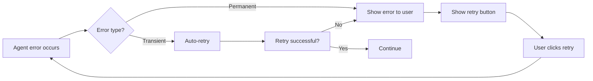
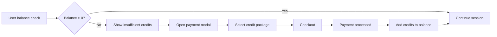

# User Flow Documentation

Complete documentation of user journeys through Lattice, with implementation status for each step.

---

## Legend

| Symbol | Meaning |
|--------|---------|
| ✅ | Implemented and working |
| 🟡 | Partially implemented |
| ❌ | Not implemented |
| 🔄 | Exists but needs work |

---

## Flow 1: New User Onboarding



### Step-by-Step Analysis

#### 1. Visit Landing Page (`/`)
| Step | Status | File | Notes |
|------|--------|------|-------|
| Render landing page | ✅ | `src/app/page.tsx` | Basic hero section |
| Show feature highlights | ✅ | `src/app/page.tsx` | "Design 3D with AI" messaging |
| Sign up/login buttons | ✅ | `src/app/page.tsx` | Links to auth pages |

#### 2. Sign Up
| Step | Status | File | Notes |
|------|--------|------|-------|
| Sign up form | ✅ | `src/app/(auth)/signup/page.tsx` | Email/password form |
| Supabase auth | ✅ | `@supabase/auth-helpers-nextjs` | Handles registration |
| Email confirmation | ✅ | Supabase config | Configured |

#### 3. Welcome Credits
| Step | Status | File | Notes |
|------|--------|------|-------|
| Grant welcome credits | ✅ | `credit.service.ts:grantWelcomeCredits()` | 100 credits on first login |
| Handle race conditions | ✅ | `credit.service.ts` | Upsert logic handles duplicates |

#### 4. Dashboard
| Step | Status | File | Notes |
|------|--------|------|-------|
| Show user's sessions | ✅ | `src/app/(protected)/dashboard/page.tsx` | Grid/list view |
| Show stats | ✅ | `DashboardContainer` | Total models, active sessions |
| Create new session | ✅ | `handleCreateSession()` | POST to `/api/sessions` |

---

## Flow 2: Create and Enter a Session

```mermaid
graph LR
    A[Dashboard] --> B[Click 'New Design Project']
    B --> C[Enter project name]
    C --> D[POST /api/sessions]
    D --> E[Session created in DB]
    E --> F[Redirect to /session/{id}]
    F --> G[Load session data]
    G --> H[Establish Socket.io connection]
    H --> I[Join session room]
    I --> J[Show chat + 3D viewer]
```

### Step-by-Step Analysis

#### 1. Create Session
| Step | Status | File | Notes |
|------|--------|------|-------|
| User submits name | ✅ | `DashboardContainer.handleCreateSession()` | UI form |
| POST `/api/sessions` | ✅ | `src/app/api/sessions/route.ts` | Creates DB record |
| Initialize credits | ✅ | `credit.service.ts` | If first time |

#### 2. Enter Session
| Step | Status | File | Notes |
|------|--------|------|-------|
| Redirect to session page | ✅ | `router.push()` | Next.js navigation |
| Load session data | ✅ | `useSession()` hook | Fetches from DB |
| Load messages | ✅ | `useMessages()` hook | Fetches chat history |
| Auth check | ✅ | `useAuth()` hook | Redirects if not logged in |

#### 3. Socket Connection
| Step | Status | File | Notes |
|------|--------|------|-------|
| Create socket connection | ✅ | `socket-provider.tsx` | Socket.io client |
| Get auth token | ✅ | `supabase.auth.getSession()` | Supabase JWT |
| Join session room | ✅ | `socket.emit("joinSession", id)` | Server-side room join |
| Handle connection errors | ✅ | Socket event listeners | Error state in UI |

#### 4. UI Components
| Step | Status | File | Notes |
|------|--------|------|-------|
| Chat interface | ✅ | `ChatInterface` | Message list + input |
| 3D model viewer | ✅ | `ModelViewer` | React Three Fiber |
| Sidebar | ✅ | `AppSidebar` | Session navigation |
| Model download | ✅ | `handleDownload()` | Signed URL from API |

---

## Flow 3: Send a Message to Agent (Core Flow)



### Step-by-Step Analysis

#### 1. Message Sending
| Step | Status | File | Notes |
|------|--------|------|-------|
| User types message | ✅ | `ChatInterface` | Textarea component |
| Attachments | ✅ | `attachment-preview.tsx` | Image/file support |
| Optimistic UI | ✅ | `socket-provider.tsx:sendMessage()` | Show before server confirms |
| Socket emit | ✅ | `socket.emit("clientMessage")` | Sends to server |

#### 2. Server Processing
| Step | Status | File | Notes |
|------|--------|------|-------|
| Receive event | ✅ | `server.ts:socket.on("clientMessage")` | Event listener exists |
| Authenticate user | 🟡 | `supabase.auth.verify()` | Needs implementation |
| Call agent service | ❌ | `startAgentProcess()` | **NOT IMPLEMENTED** |

#### 3. Agent Execution
| Step | Status | File | Notes |
|------|--------|------|-------|
| Create sandbox pod | ✅ | `sandbox.service.ts:createPod()` | Pod creation exists |
| Wait for ready | 🟡 | `waitForBridgeReady()` | Partial implementation |
| POST to bridge | ✅ | `executeBridgeRun()` | Bridge call exists |
| Agent executes | 🔄 | `bridge/index.js` | Bridge exists, agent integration partial |
| Export STL | ✅ | `cad_engine/generator.py` | Python script exists |

#### 4. Results Streaming
| Step | Status | File | Notes |
|------|--------|------|-------|
| Stream agent logs | ❌ | Socket events | **NOT IMPLEMENTED** |
| Update loading state | ✅ | `agentLoading` event | Exists in socket-provider |
| Emit tool status | 🟡 | `toolStatus` event | Partial implementation |
| Emit model update | ✅ | `modelUpdated` event | Exists |
| Emit final message | ✅ | `agentMessage` event | Exists |

#### 5. Cost Tracking
| Step | Status | File | Notes |
|------|--------|------|-------|
| Calculate cost | ✅ | `cost.service.ts:calculateCost()` | Token-based calculation |
| Deduct credits | ✅ | `credit.service.ts:deductCredits()` | Atomic deduction |
| Record transaction | ✅ | `credit.service.ts` | Transaction history |
| Update session | ✅ | `session.service.ts:updateSession()` | Cost field update |
| Real-time update | ✅ | `sessionCostUpdated` event | Socket emission exists |

#### 6. Artifact Storage
| Step | Status | File | Notes |
|------|--------|------|-------|
| Pull artifacts from pod | ✅ | `pullArtifacts()` | Method exists |
| Upload to Supabase | ✅ | `supabaseAdmin.storage.upload()` | Upload logic exists |
| Persist session log | ❌ | `conversation_log` update | **NOT IMPLEMENTED** |
| Signed URL for download | ✅ | `api/model/[sessionId]/route.ts` | Returns signed URL |

---

## Flow 4: View and Download 3D Model

```mermaid
graph LR
    A[Model updated notification] --> B[ModelViewer refresh]
    B --> C[GET /api/model/{sessionId}]
    C --> D[Get signed URL]
    D --> E[Load STL in Three.js]
    E --> F[Display in Canvas]
    F --> G[User can rotate/zoom]
    G --> H[Click Export STL]
    H --> I[Download STL file]
```

### Step-by-Step Analysis

| Step | Status | File | Notes |
|------|--------|------|-------|
| Listen for model update | ✅ | `socket-provider.tsx:triggerModelReload()` | modelReloadKey updates |
| Fetch signed URL | ✅ | `api/model/[sessionId]/route.ts` | 5-minute signed URL |
| Auth check | ✅ | `validateSessionOwnership()` | Ensures user owns session |
| Load STL with STLLoader | ✅ | `ModelMesh` component | React Three Fiber |
| OrbitControls | ✅ | `@react-three/drei` | Camera controls |
| Stage with lighting | ✅ | `Stage` component | Environment lighting |
| Download STL | ✅ | `handleDownload()` | Creates anchor element |
| Export button | ✅ | `ModelViewer` UI | Download button |

---

## Flow 5: Session History and Management



### Step-by-Step Analysis

| Step | Status | File | Notes |
|------|--------|------|-------|
| List all sessions | ✅ | `useSessions()` hook | Fetches from DB |
| Search sessions | ✅ | `DashboardContainer` | Client-side filtering |
| Sort by updated | ✅ | `useSessions()` | updatedAt sorting |
| View session detail | ✅ | `/session/[id]` | Session page |
| Load chat history | ✅ | `useMessages()` | Fetches messages |
| View model history | ❌ | | **NOT IMPLEMENTED** |
| Replay conversation | ❌ | | **NOT IMPLEMENTED** |
| Continue session | 🟡 | | Agent doesn't have history |

### Missing: Session History

The `conversation_log` field in the database exists but is **never written to**, which means:
1. **Session reload loses context** - Agent starts fresh every time
2. **No conversation replay** - Cannot view previous agent thoughts
3. **No model history** - Cannot see which prompt generated which model
4. **Debugging is hard** - No log of agent execution steps

---

## Flow 6: Error Handling and Recovery



### Error Scenarios

#### Scenario 1: Network Error
| Step | Status | File | Notes |
|------|--------|------|-------|
| Detect connection loss | ✅ | `socket.on("disconnect")` | Socket reconnection |
| Show disconnected state | ✅ | UI shows error | UI handles error |
| Auto-reconnect | ✅ | Socket.io built-in | Automatic |
| Resume session | ❌ | | **NOT IMPLEMENTED** |

#### Scenario 2: Agent Crash
| Step | Status | File | Notes |
|------|--------|------|-------|
| Detect pod failure | ✅ | `sandbox.service.ts` | Pod status check |
| Retry execution | ❌ | | **NOT IMPLEMENTED** |
| Show error message | ❌ | | **NOT IMPLEMENTED** |
| User can retry | ❌ | | **NOT IMPLEMENTED** |

#### Scenario 3: Insufficient Credits
| Step | Status | File | Notes |
|------|--------|------|-------|
| Check balance | ✅ | `credit.service.ts:deductCredits()` | RPC enforces balance |
| Notify user | ✅ | `socket-provider.tsx` | Toast notification |
| Show payment modal | ✅ | `credits-modal.tsx` | UI component exists |
| Process payment | ❌ | | **NOT IMPLEMENTED** |

#### Scenario 4: Token Limit Exceeded
| Step | Status | File | Notes |
|------|--------|------|-------|
| LLM rejects | 🟡 | Bridge handles | Partial |
| Truncate history | ❌ | | **NOT IMPLEMENTED** |
| Fallback model | ❌ | | **NOT IMPLEMENTED** |

---

## Flow 7: Credit Management



### Step-by-Step Analysis

| Step | Status | File | Notes |
|------|--------|------|-------|
| Display balance | ✅ | Sidebar/header | Shows credit count |
| Check before action | ✅ | `deductCredits()` | Enforced by RPC |
| Show error on low balance | ✅ | Toast notification | `insufficientCredits` event |
| Payment modal UI | ✅ | `credits-modal.tsx` | Component exists |
| Payment processing | ❌ | | **NOT IMPLEMENTED** |
| Stripe integration | ❌ | | **NOT IMPLEMENTED** |
| Credit packages | ❌ | | **NOT IMPLEMENTED** |

---

## Flow 8: Session Deletion

```mermaid
graph LR
    A[Dashboard] --> B[Delete button]
    B --> C[Confirm deletion]
    C --> D[DELETE /api/sessions/{id}]
    D --> E[Delete session]
    E --> F[Delete messages]
    F --> G[Delete artifacts]
    G --> H[Remove from UI]
```

### Step-by-Step Analysis

| Step | Status | File | Notes |
|------|--------|------|-------|
| Delete button | ✅ | `SessionTableRow` | UI exists |
| Confirmation dialog | ✅ | Dialog component | UI confirmation |
| DELETE endpoint | ✅ | `api/sessions/[id]/route.ts` | Exists |
| Delete session record | ✅ | `deleteSession()` | Cascading delete |
| Delete messages | ✅ | FK cascade | Automatic |
| Delete artifacts | ❌ | | **NOT IMPLEMENTED** |
| Remove from UI | ✅ | React state update | Optimistic update |

---

## Flow Gaps Summary

| Flow | Completion | Critical Missing Pieces |
|------|-----------|----------------------|
| 1. New User Onboarding | 95% | Payment processing |
| 2. Create & Enter Session | 95% | None |
| 3. Send Message to Agent | 40% | Agent execution, log streaming |
| 4. View/Download Model | 100% | None |
| 5. Session History | 30% | Conversation log persistence |
| 6. Error Handling | 20% | Retry logic, error recovery |
| 7. Credit Management | 60% | Payment processing |
| 8. Session Deletion | 70% | Artifact cleanup |

### Critical Gaps Blocking Production

1. **Agent Execution** (Flow 3) - No way for user messages to trigger agent work
2. **Conversation Persistence** (Flow 5) - No session context between messages
3. **Error Recovery** (Flow 6) - No recovery from failures
4. **Payment Processing** (Flow 7) - Cannot add credits
